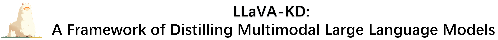
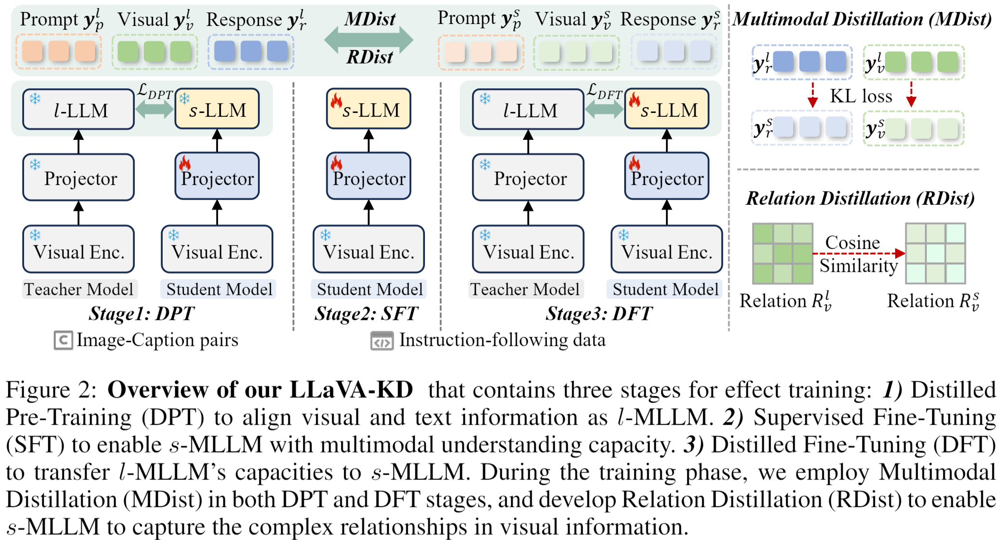
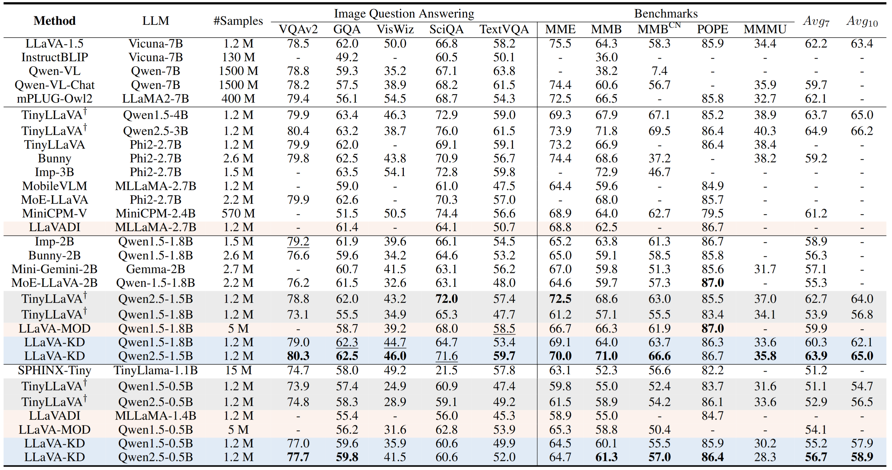
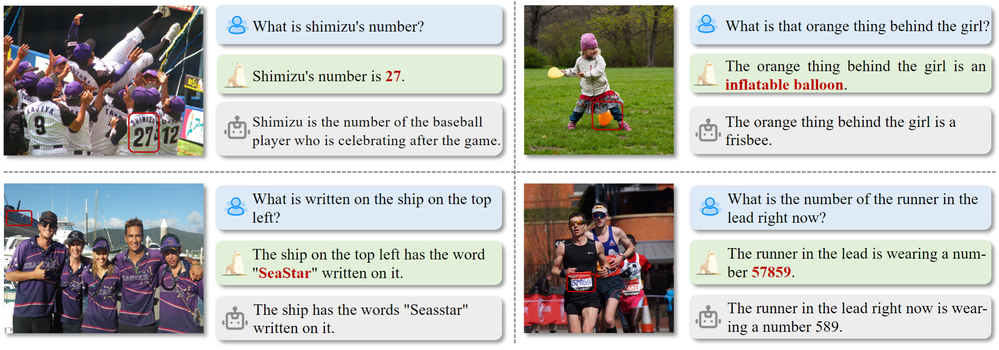

<div align="center">

<!-- <h3>A Framework of Distilling Multimodal Large Language Models</h3> -->

[Yuxuan Cai<sup>1*</sup>](https://scholar.google.com/citations?user=J9lTFAUAAAAJ&hl=en&oi=ao),
[Jiangning Zhang<sup>2,3*</sup>](https://zhangzjn.github.io),
[Haoyang He<sup>2</sup>](https://scholar.google.com/citations?hl=zh-CN&user=8NfQv1sAAAAJ),
[Xinwei He<sup>4</sup>](https://scholar.google.com/citations?user=YSIe_24AAAAJ&hl=en&oi=ao),
[Ao Tong<sup>1</sup>](),  

[Zhenye Gan<sup>3</sup>](https://scholar.google.com/citations?user=fa4NkScAAAAJ&hl=zh-CN),
[Chengjie Wang<sup>3</sup>](https://scholar.google.com/citations?hl=zh-CN&user=fqte5H4AAAAJ),
[Zhucun Xue<sup>2</sup>](https://scholar.google.com/citations?user=m3KDreEAAAAJ&hl=en),
[Yong Liu<sup>2</sup>](https://scholar.google.com/citations?user=qYcgBbEAAAAJ&hl=en&oi=ao),
[Xiang Bai<sup>1</sup>](https://scholar.google.com/citations?user=UeltiQ4AAAAJ&hl=en&oi=ao)

<sup>1</sup>Huazhong University of Science and Technology,

<sup>2</sup>Zhejiang University,
<sup>3</sup>Youtu Lab, Tencent,
<sup>4</sup>Huazhong Agricultural University

[[`Paper`](https://arxiv.org/pdf/2410.16236)] 

</div>

## Abstract

The success of Large Language Models (LLMs) has inspired the development of Multimodal Large Language Models (MLLMs) for unified understanding of vision and language. However, the increasing model size and computational complexity of large-scale MLLMs ($l$-MLLMs) limit their use in resource-constrained scenarios. Although small-scale MLLMs ($s$-MLLMs) are designed to reduce computational costs, they typically suffer from performance degradation. To mitigate this limitation, we propose a novel LLaVA-KD framework to transfer knowledge from $l$-MLLMs to $s$-MLLMs. Specifically, we introduce Multimodal Distillation (MDist) to transfer teacher model's robust representations across both visual and linguistic modalities, and Relation Distillation (RDist) to transfer teacher model's ability to capture visual token relationships. Additionally, we propose a three-stage training scheme to fully exploit the potential of the proposed distillation strategy: (1) Distilled Pre-Training to strengthen the alignment between visual-linguistic representations in $s$-MLLMs, (2) Supervised Fine-Tuning to equip the $s$-MLLMs with multimodal understanding capacity, and (3) Distilled Fine-Tuning to refine $s$-MLLM's knowledge. Our approach significantly improves $s$-MLLMs performance without altering the model architecture. Extensive experiments and ablation studies validate the effectiveness of each proposed component.
---

## Overview
<p align="center">
  
</p>

---

## 📜 Main Results on 10 Popular Benchmarks
Benchmarked results with SoTA MLLMs.  Compared with counterparts, our \method~achieves highly competitive results than current small-scale MLLM models. 
AVG: The average of the nine benchmarks for comprehensive comparison except MMMU. $^\dagger$: reproduced results using the official code.


---

## 🛠️ Installation

- Install torch and torchvision
  ```shell
  pip install torch==2.1.2 torchvision==0.16.2 --index-url https://download.pytorch.org/whl/cu118
  ```
- Prepare the environment
  ```shell
  python3 -m pip install --no-cache-dir --upgrade -r requirements.txt
  python3 -m pip install numpy==1.26.2
  python3 -m pip install urllib3==1.26.6
  pip install ptflops
  ```
- Install Flash Attention
  ```shell
  git clone https://github.com/Dao-AILab/flash-attention.git
  cd ./flash-attention
  python3 -m pip install wheel==0.41.3
  python3 setup.py install
  ```
- Install bitsandbytes
  ```shell
  git clone https://github.com/bitsandbytes-foundation/bitsandbytes.git
  cd ./bitsandbytes
  pip install -e .
  ```

## LLaVA-KD Weights
| Model                                                   | Vision Encoder                                               | LLM                                                           |  CKPTs
| ------------------------------------------------------------ | ------------------------------------------------------------ | ------------------------------------------------------------  | ------------------------------------------------------------  |
| LLaVA-KD-1B | [siglip-so400m-patch14-384](https://huggingface.co/google/siglip-so400m-patch14-384) |  [Qwen/Qwen1.5-0.5B](https://huggingface.co/Qwen/Qwen1.5-0.5B)     | [LLaVA-KD-Base-siglip-Qwen1.5-0.5B](https://drive.google.com/file/d/1eoGzu3kKG4qB2Y2nxJ5axVO7uJNP3CJU/view?usp=drive_link)
| LLaVA-KD-2B | [siglip-so400m-patch14-384](https://huggingface.co/google/siglip-so400m-patch14-384) |  [Qwen/Qwen1.5-1.8B](https://huggingface.co/Qwen/Qwen1.5-1.8B)     | [LLaVA-KD-Base-siglip-Qwen1.5-1.8B](https://drive.google.com/file/d/1T9K0aoS9bgzkC1taRplNT_QglpbfrdbC/view?usp=drive_link)


## :computer: Evaluation
Please evaluate the model according to [Evaluation.md](docs/Evaluation.md).

## Quickstart
Download the Pre-trained VisualEnc, LLM, LLaVAKD weights to the `./pretrained_ckpt`. And then:
  ```shell
  python quick_inference.py --model_path ./pretrained_ckpt/LLaVAKD_Model_Path --image_file ./image_test/img_test_1.jpg  --query "What is that orange thing behind the girl?"
  ```
<p align="center">
  
</p>


## :ballot_box_with_check: TODO List
- [ ] Release the training code
- [ ] Release the checkpoints

## :dizzy: Citation
If you find this code useful, don't forget to star the repo and cite the paper.
```
@article{cai2024llava,
  title={LLaVA-KD: A Framework of Distilling Multimodal Large Language Models},
  author={Cai, Yuxuan and Zhang, Jiangning and He, Haoyang and He, Xinwei and Tong, Ao and Gan, Zhenye and Wang, Chengjie and Bai, Xiang},
  journal={arXiv preprint arXiv:2410.16236},
  year={2024}
}
```

## 💘 Acknowledgements
We thank the great works [TinyLLaVA](https://github.com/TinyLLaVA/TinyLLaVA_Factory), [LLaVA](https://github.com/haotian-liu/LLaVA) for providing assistance for our research.

